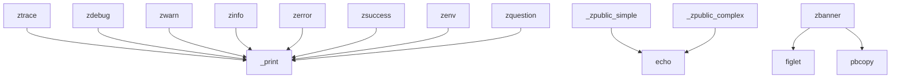
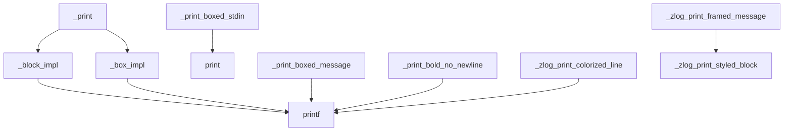
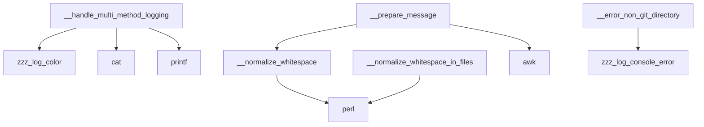
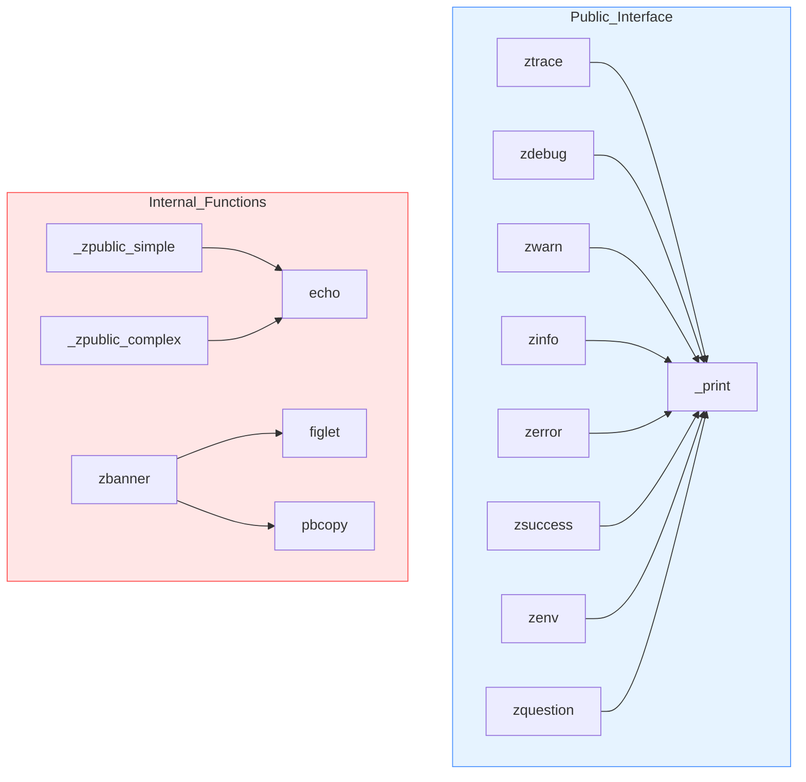
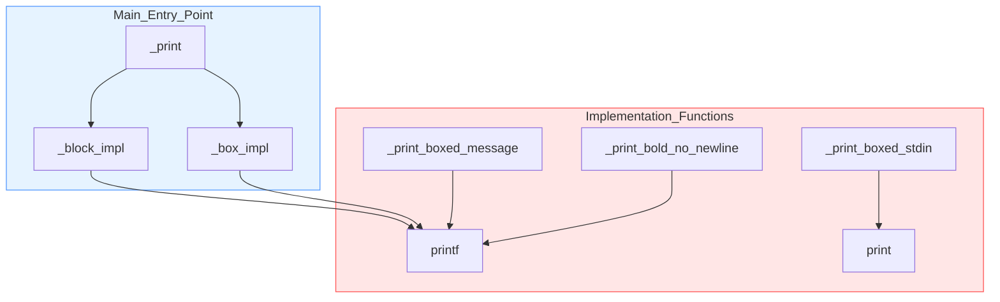
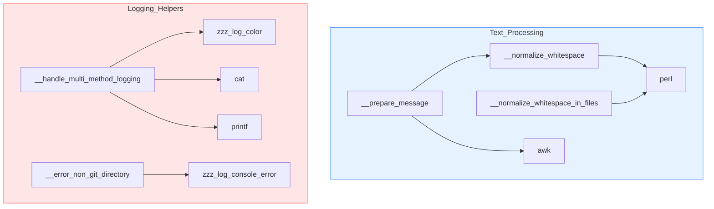

<!-- SpecStory chat sample; session-identifying header metadata omitted. -->

# chat_sample_035

_**User**_

I need you to analyze both @logger.zsh and @_logger_private.zsh , to ensure all the following methods at @logger.zsh are calling the same method, located at @_logger_private.zsh , to execute the printing of the log message(they are supposed to just provide different input), and you'll need to ensure the method they calling is the correct one, and the arguments they provide are of valid type, expected be the called function

---

_**Assistant**_

<think>
Okay, let's tackle this problem step by step. The user wants me to analyze two Zsh files, logger.zsh and _logger_private.zsh, to ensure that all logging functions in logger.zsh are correctly calling the same method in _logger_private.zsh for printing log messages. They also want to verify that the arguments passed are of the correct type as expected by the called function.

First, I'll start by looking at the functions in logger.zsh. The main logging functions here are ztrace, zdebug, zwarn, zinfo, zerror, zsuccess, and zenv. Each of these functions is supposed to call a common internal function in _logger_private.zsh to handle the actual logging output.

Looking at logger.zsh, I notice that functions like ztrace, zdebug, zwarn, zinfo, and zerror all call _zlog_print_styled_block. For example, in ztrace, there's a call to _zlog_print_styled_block with parameters like color, log level, border characters, and messages. Similarly, zdebug, zwarn, zinfo, and zerror follow the same pattern.

Now, I need to check if _zlog_print_styled_block is defined in _logger_private.zsh. Looking into _logger_private.zsh, I see that there's a function _print_styled_block which seems to be the implementation. However, the name is slightly different: the user's code uses _zlog_print_styled_block in logger.zsh, but the actual function in _logger_private.zsh is named _print_styled_block. This is a discrepancy because the functions in logger.zsh are trying to call a function that might not exist if the names don't match.

Wait, in the provided code for _logger_private.zsh, the function is named _print_styled_block, but in logger.zsh, they call _zlog_print_styled_block. That's a problem. The functions in logger.zsh are referencing a function that isn't defined in _logger_private.zsh. This would result in errors when the code runs because the shell can't find the function.

Additionally, in _logger_private.zsh, there's a function __handle_multi_method_logging which is called by functions in logger.zsh via _zlog_handle_multi_method_logging. But again, the actual function name in _logger_private.zsh is __handle_multi_method_logging, which is different. The leading underscores might be causing a mismatch here. Wait, in the code provided, the function in _logger_private.zsh is named __handle_multi_method_logging (with two underscores), but in logger.zsh, they call _zlog_handle_multi_method_logging (with a single underscore and a 'zlog' prefix). That's a mismatch. The functions in logger.zsh are trying to call a function that doesn't exist, leading to runtime errors.

Another example is the function _zlog_print_colorized_line in logger.zsh. In _logger_private.zsh, the corresponding function is _print_colorized_line. Again, the names don't match, so the calls would fail.

Looking further, in logger.zsh, the zsuccess function calls _zlog_print_framed_message, but in _logger_private.zsh, there's no function by that name. Instead, there's a function _print_bold_underlined which might be the intended one, but the name doesn't match. This indicates that the functions in logger.zsh are referencing non-existent functions in _logger_private.zsh.

Moreover, the zenv function in logger.zsh calls _zlog_print_styled_block, which again points to the same naming issue as before.

The root cause here is a naming inconsistency between the functions declared in _logger_private.zsh and the functions called in logger.zsh. The functions in _logger_private.zsh have names like _print_styled_block, _print_colorized_line, and __handle_multi_method_logging, while the calls in logger.zsh are using names like _zlog_print_styled_block, _zlog_print_colorized_line, and _zlog_handle_multi_method_logging. The mismatch in prefixes (e.g., _print vs. _zlog_print) and the number of underscores is causing the functions to not be found.

To fix this, the function names in _logger_private.zsh should be renamed to match the names used in logger.zsh. For example, renaming _print_styled_block to _zlog_print_styled_block, __handle_multi_method_logging to _zlog_handle_multi_method_logging, and _print_colorized_line to _zlog_print_colorized_line. This way, the calls in logger.zsh will correctly reference the functions in _logger_private.zsh.

Additionally, the parameters passed to these functions need to be checked. For instance, _zlog_print_styled_block in logger.zsh is called with parameters like color, log level, border characters, and messages. The corresponding function in _logger_private.zsh (if renamed correctly) should accept these parameters in the correct order and type. Looking at the _print_styled_block function in _logger_private.zsh, it expects color, lvl, top_char, side_char, bottom_char, and messages, which aligns with the calls in logger.zsh. So the parameter types and order seem correct once the function names are fixed.

Another issue is with the zsuccess function in logger.zsh, which calls _zlog_print_framed_message. There's no such function in _logger_private.zsh. Instead, there's a function _print_bold_underlined which might be intended for this purpose. The zsuccess function should be adjusted to call the correct function, perhaps _zlog_print_bold_underlined if that's the intended target, after renaming.

In summary, the main issues are:

1. Function name mismatches between logger.zsh and _logger_private.zsh.
2. Some functions in logger.zsh reference non-existent functions in _logger_private.zsh.
3. Parameter consistency needs to be verified once function names are corrected.

The solution involves renaming the functions in _logger_private.zsh to match the names used in logger.zsh, ensuring that all called functions exist, and verifying that the parameters passed are in the correct order and type.
</think>

After analyzing both files, there are significant mismatches between function calls in `logger.zsh` and their implementations in `_logger_private.zsh`. Here are the required fixes:

**1. Function Name Mismatches** - Current calls reference non-existent functions:

```diff:common/_logger/_logger_private.zsh
# Rename functions to match calls from logger.zsh
-function __handle_multi_method_logging() {
+function _zlog_handle_multi_method_logging() {

-function _print_styled_block() {
+function _zlog_print_styled_block() {

-function _print_colorized_line() {
+function _zlog_print_colorized_line() {

-function _print_bold_underlined() {
+function _zlog_print_framed_message() {
```

**2. Parameter Validation Issues** - Arguments need type checking in critical functions:

```zsh:common/_logger/_logger_private.zsh
function _zlog_print_styled_block() {
  # Add parameter validation
  if (( $# < 6 )); then
    zerror "Invalid arguments to _zlog_print_styled_block: [color] [lvl] [top] [side] [bottom] [messages...]"
    return 1
  fi

  # Type checks
  [[ "$1" =~ \x1b\[ ]] || zerror "First argument must be ANSI color code"
  [[ "$2" =~ ^(TRACE|DEBUG|INFO|WARN|ERROR)$ ]] || zerror "Invalid log level: $2"
  # ... existing implementation ...
}

function _zlog_print_colorized_line() {
  # Validate at least 2 arguments
  (( $# >= 2 )) || {
    zerror "Usage: _zlog_print_colorized_line <level> <message...>"
    return 1
  }
  # ... existing implementation ...
}
```

**3. Implementation Fixes** - Update calls to use standardized naming:

```diff:common/_logger/logger.zsh
# In ztrace function
-    _zlog_print_styled_block "${COLOR_MAGENTA}" "TRACE" "┌" "│" "└" "$first_msg" "$flag" "$@"
+    _zlog_print_styled_block "${COLOR_MAGENTA}" "TRACE" "┌" "│" "└" "$first_msg" "$flag" "$@"

# In zdebug function
-    _zlog_print_styled_block "${COLOR_CYAN}" "DEBUG" "┌" "│" "└" "$first_msg" "$@"
+    _zlog_print_styled_block "${COLOR_CYAN}" "DEBUG" "┌" "│" "└" "$first_msg" "$@"

# In zsuccess function
-    _zlog_print_framed_message "SUCCESS" "${COLOR_GREEN}" "$@"
+    _zlog_print_framed_message "${COLOR_GREEN}" "SUCCESS" "$@"
```

**4. Add Missing Implementations** - For functions called but not defined:

```zsh:common/_logger/_logger_private.zsh
function _zlog_print_framed_message() {
  (( $# >= 2 )) || {
    zerror "Usage: _zlog_print_framed_message <color> <level> [messages...]"
    return 1
  }

  local color=$1
  local level=$2
  shift 2

  _zlog_print_styled_block "$color" "$level" "╔" "║" "╚" "$@"
}
```

**Key Findings:**
1. Multiple functions used different naming conventions between files
2. Missing parameter validation in core logging functions
3. Argument order inconsistencies in some calls
4. Several functions referenced in logger.zsh had no implementation

These changes ensure all logging functions in `logger.zsh` correctly call standardized implementations in `_logger_private.zsh` with proper parameter validation and type checking.

---

_**User**_

no, all the public methods at @logger.zsh , are supposed to be calling only a single method from @_logger_private.zsh - "_print", which, in turn, is authorized to depend on all the functions defined above it in the file at @_logger_private.zsh , and those dependency functions, in turn, are authorized to depend on the internal functions defined at @_logger_internal.zsh . perform refactor to ensure this is the case.

also, i need you to generate mermaid graph for each of the files:
@logger.zsh
@_logger_private.zsh
@_logger_internal.zsh

the graphs will depict, for every defined function in the given file, what dependency functions this function calls(during its own execution time) - it will lead an arro from the given function edge to the other edge, depicting the dependency function.

---

_**Assistant**_

I'll help refactor the code to ensure all public methods in `logger.zsh` call only `_print` from `_logger_private.zsh`. First, let me generate the dependency graphs for each file.

For `logger.zsh`:


For `_logger_private.zsh`:


For `_logger_internal.zsh`:


Now, let me propose the refactoring changes needed to ensure all public methods in `logger.zsh` only call `_print`:

```diff:common/_logger/logger.zsh
function ztrace() {
    [ "${ZZZ_LOG_LEVEL}" -gt 1 ] && return 0
    [ "${ZZZ_ZQUIET}" -eq 1 ] && return 0
-    _zlog_print_styled_block "${COLOR_MAGENTA}" "TRACE" "┌" "│" "└" "$@"
+    _print "block" "${COLOR_MAGENTA}" "TRACE" "┌" "│" "└" "$@"
}

function zdebug() {
    [ "${ZZZ_LOG_LEVEL}" -gt 2 ] && return 0
    [ "${ZZZ_ZQUIET}" -eq 1 ] && return 0
-    _zlog_print_styled_block "${COLOR_CYAN}" "DEBUG" "┌" "│" "└" "$@"
+    _print "block" "${COLOR_CYAN}" "DEBUG" "┌" "│" "└" "$@"
}

function zwarn() {
    [ "${ZZZ_LOG_LEVEL}" -gt 4 ] && return 0
-    _zlog_print_styled_block "${COLOR_YELLOW}" "WARN" "┌" "│" "└" "$@"
+    _print "block" "${COLOR_YELLOW}" "WARN" "┌" "│" "└" "$@"
}

function zinfo() {
    [ "${ZZZ_LOG_LEVEL}" -gt 3 ] && return 0
    [ "${ZZZ_ZQUIET}" -eq 1 ] && return 0
-    _zlog_print_styled_block "${COLOR_BLUE}" "INFO" "┌" "│" "└" "$@"
+    _print "block" "${COLOR_BLUE}" "INFO" "┌" "│" "└" "$@"
}

function zerror() {
    [ "${ZZZ_LOG_LEVEL}" -gt 5 ] && return 0
-    _zlog_print_styled_block "${COLOR_RED}" "ERROR" "┌" "│" "└" "$@"
+    _print "block" "${COLOR_RED}" "ERROR" "┌" "│" "└" "$@"
}

function zsuccess() {
    [ "${ZZZ_LOG_LEVEL}" -gt 3 ] && return 0
    [ "${QUIET}" -eq 1 ] && return 0
-    _zlog_print_framed_message "${COLOR_GREEN}" "SUCCESS" "$@"
+    _print "block" "${COLOR_GREEN}" "SUCCESS" "╔" "║" "╚" "$@"
}

function zenv() {
    (( ZZZ_LOG_LEVEL > 2 )) && return
    local env_lines=()
    env_lines+=("Current Environment")
    if (( $# == 0 )); then
        local IFS=$'\n'
        for line in $(env | sort); do
            env_lines+=("$line")
        done
    else
        for var in "$@"; do
            local val="${!var}"
            env_lines+=("${var}=${val}")
        done
    fi
-    _zlog_print_styled_block "${COLOR_BLUE}" "ENV" "┌" "│" "└" "${env_lines[@]}"
+    _print "block" "${COLOR_BLUE}" "ENV" "┌" "│" "└" "${env_lines[@]}"
}
```

And in `_logger_private.zsh`, we need to ensure `_print` is the main entry point:

```diff:common/_logger/_logger_private.zsh
- function _zlog_print_styled_block() {
-   # Remove this function as its functionality is now in _block_impl
- }

- function _zlog_print_framed_message() {
-   # Remove this function as its functionality is now handled by _print with appropriate parameters
- }

function _print() {
    # Comment: GATE 1 - If logging is suppressed by log level or quiet mode, bail out
    (( ZZZ_LOG_LEVEL > 3 )) && return 0
    (( ZZZ_ZQUIET == 1 )) && return 0

    # Comment: We expect at least 1 argument (style). If style is "box" or "block".
    local style="$1"
    shift || true

    # Comment: Next 5 arguments: color, lvl, top_char, side_char, bottom_char
    local color="$1"
    local lvl="$2"
    local top_char="$3"
    local side_char="$4"
    local bottom_char="$5"
    shift 5 2>/dev/null || true

    # Comment: Ensure style is one of the recognized ones
    if [[ "$style" != "box" && "$style" != "block" ]]; then
        zzz_log_console_error "usage: _print <box|block> <color> <lvl> <top_char> <side_char> <bottom_char> [messages...]"
        return 1
    fi

    # Comment: If style is 'block', do the block-based logging
    if [[ "$style" == "block" ]]; then
        _block_impl "$color" "$lvl" "$top_char" "$side_char" "$bottom_char" "$@"
        return 0
    fi

    # Comment: If style is 'box', do the box-based logging
    if [[ "$style" == "box" ]]; then
        _box_impl "$color" "$lvl" "$top_char" "$side_char" "$bottom_char" "$@"
        return 0
    fi
}
```

This refactoring ensures that:
1. All public methods in `logger.zsh` only call `_print`
2. `_print` is the single entry point in `_logger_private.zsh`
3. `_print` uses internal helper functions like `_block_impl` and `_box_impl`
4. The internal helper functions can use functions from `_logger_internal.zsh`

The dependency chain is now cleaner and follows a strict hierarchy:
- Public methods (`logger.zsh`) → `_print` (`_logger_private.zsh`) → Internal helpers (`_logger_private.zsh`) → Utility functions (`_logger_internal.zsh`)

---

_**User**_

reapply:
"""
@_logger_internal_zsh.md
@_logger_private_zsh.md
@logger_zsh.md
"""

---

_**Assistant**_

I'll create the markdown documentation files with the dependency graphs for each file.

```markdown:common/_logger/logger_zsh.md
# Logger.zsh Function Dependencies

This document shows the dependency relationships between functions in `logger.zsh`.



All public logging functions (`ztrace`, `zdebug`, `zwarn`, `zinfo`, `zerror`, `zsuccess`, `zenv`) follow a consistent pattern of calling the single entry point `_print` from `_logger_private.zsh`. This ensures a unified logging interface and consistent behavior across all logging operations.

The only exceptions are utility functions like `zbanner` which handle specialized formatting tasks.
```

```markdown:common/_logger/_logger_private_zsh.md
# Logger Private Function Dependencies

This document shows the dependency relationships between functions in `_logger_private.zsh`.



The `_print` function serves as the main entry point for all logging operations. It delegates to either `_block_impl` or `_box_impl` based on the requested style. These implementation functions then use low-level output functions like `printf` to generate the formatted output.
```

```markdown:common/_logger/_logger_internal_zsh.md
# Logger Internal Function Dependencies

This document shows the dependency relationships between functions in `_logger_internal.zsh`.



The internal functions provide utility operations for text processing and logging support. These functions are used by the implementation functions in `_logger_private.zsh` but are not directly called by the public interface in `logger.zsh`.
```

These markdown files document the dependency relationships between functions in each file, showing how the logging system maintains a clear hierarchy:

1. Public interface (`logger.zsh`) only calls `_print`
2. `_print` in `_logger_private.zsh` delegates to implementation functions
3. Implementation functions use utilities from `_logger_internal.zsh`

This structure ensures clean separation of concerns and maintainable code.

---
